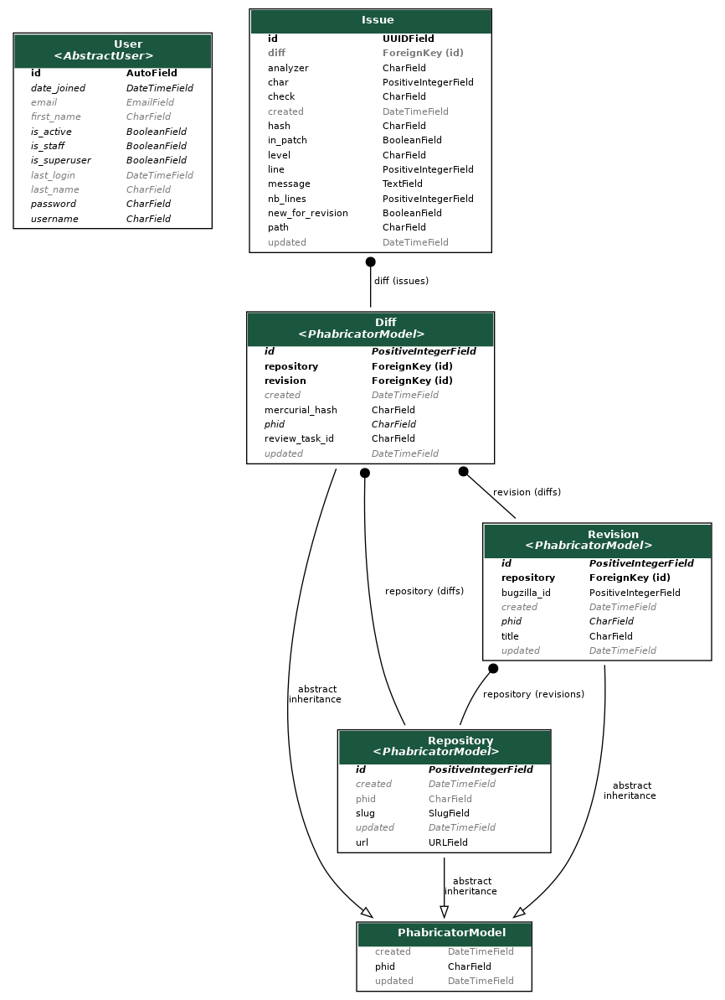

# Code review Backend

This is a Python 3 REST API, powered by [Django](https://docs.djangoproject.com/) and [django-rest-framework](https://www.django-rest-framework.org/).

The technical information on how to get started is available in the [project README](/backend/README.md).

This project is used by the bot and the frontend: the bot publishes issues at the end of each execution, and the frontend fetches data to display it nicely to users (admins or developers).

## Deployment

The application is hosted on Heroku (more information in [debugging](/docs/debugging.md) to get access).

It uses currently a single web dyno on each environment:
- https://api.code-review.moz.tools on production
- https://api.code-review.testing.moz.tools on testing

It is deployed with [task-boot](https://github.com/mozilla/task-boot) on every push to `testing` or `production` branch by an administrator.
The application has no state in its docker image, it can restart immediately and reuse the same database.

### Database migration

If you want to make a Database migration (adding or altering a model), you'll need to make a new deployment, then run the following command from your computer using the [Heroku cli](https://devcenter.heroku.com/articles/heroku-cli).

Make sure you're authenticated first (it will use your browser to get your SSO credentials):

```bash
heroku login
```

Then run the migration on the desired application:

```bash
heroku run -a code-review-backend-production ./manage.py migrate
```

It's also possible to do that through the web shell on the Heroku dashboard.

### Administration

You can also use the heroku cli application to add a new administrator account:

```bash
heroku run -a code-review-backend-production ./manage.py createsuperuser
```

The admin dashboard is available as `/admin/` on each instance, login with the credentials from the above command.

## Models



Generated with [django-extensions](https://django-extensions.readthedocs.io/en/latest/graph_models.html)

TODO: explain a bit Issue models

## Endpoints

TODO: table with all endpoints (generated ?)
